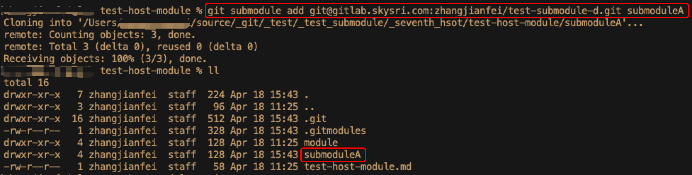
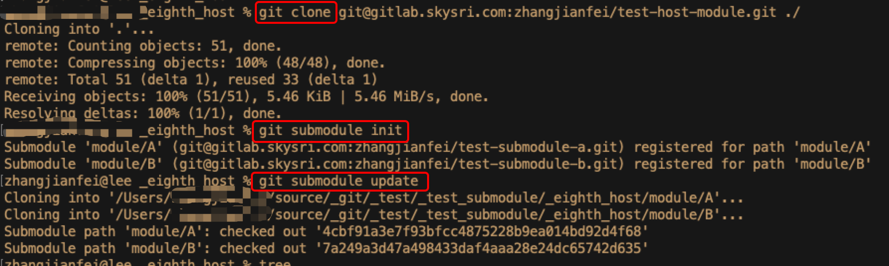
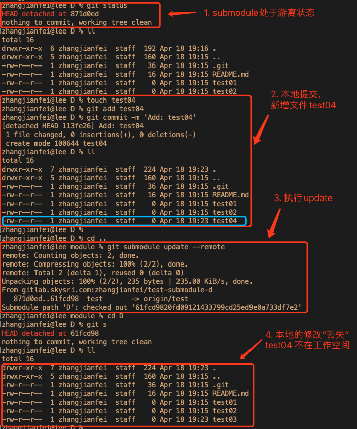
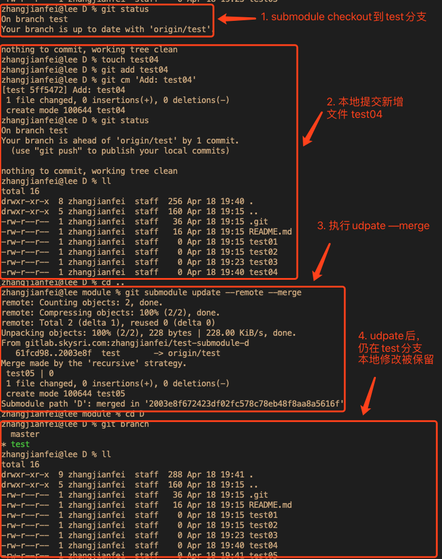
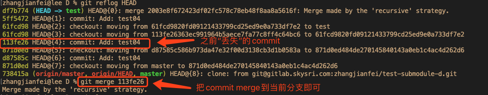
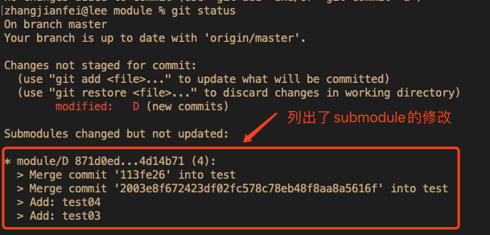

# Submodule Better Practice

(文中提到的仓库特指git仓库)

## 1. 背景介绍

开发中可能会遇到这样的情况: 

- 项目依赖一个library
- 这个library在多个项目中都要用到(符合封装复用的原则) 
- ****，我需要根据需求修改library的内容
- 而且不同项目依赖的library可能不是版本

如果把library的文件直接放在当前项目的仓库中，会导致一个问题：不同项目同步library的更新会变成一场灾难(耗费大量时间且易出错)。

于是，`submodule` 诞生了:

submodule提供了一种能力：在一个仓库中，允许以“子目录”的形式存放另一个仓库，同时两个仓库独立提交。

(“子目录”打引号是因为并不是真正的子目录)

回到上面的需求：

- library作为单独的仓库以submodule的形式引入到不同的项目中
- 一个项目更新了library，其他项目可以方便地更新
- 不同的项目可以方便地维护不同的library版本

...

## 2. 各个场景的用法

### 2.1 给仓库添加submodule

```git
git submodule add url moduleName
```



### 2.2 clone一个有submodule的仓库

#### 2.2.1常规操作 

如果clone的仓库有submodule，是不能直接使用的，需要运行以下两条命令来初始化。

```git
git submodule init
git submodule update
```



(上面的两步可以简化为一步:`git submodule update --init`)

#### 2.2.2 submodule中嵌套了submodule

上面的操作不会初始化嵌套的submodule，如果遇到嵌套的情况，你当然可以cd到对应目录，再次执行`git submodule init`和`git submodule update`，还有一个便捷操作:

```git
git submodule update --init --recursive
```

### 2.3 更新远程submodule

submodule会经常更新， `update` 是submodule非常重要的操作，它的作用是:

> Update the registered submodules to match what the superproject expects by cloning missing submodules, fetching missing commits in submodules and updating the working tree of the submodules.

可见，根据命令的参数，`update`的功能非常丰富:

- clone本地缺失的submodule
- fetch(submodule中)本地缺失的commits
- 更新工作空间(就是当前目录中看到的代码)

更新远程submodule的基础操作是

```
git submodule update --remote
```

以下是各种场景的用法

#### 2.3.1 远程添加了新的submodule

```
git submodule update --init --remote
```

#### 2.3.2 远程submodule有更新，本地没更新

```
git submodule update --remote
```

#### 2.3.3  **远程submodule有更新，本地也有更新**

现在是这篇文章最重要的部分，因为这个场景是submodule常见场景中最让人困惑的，如果你直接按照上面的操作(`git submodule update --remote`), 会发现本地的提交不见了。

想要解决这个问题，就要知道`git submodule update --remote`到底做了什么：

- 对于每一个submodule, git 会fetch其远程master分支(*可配置)的最新commit。
- 拉取到新的commit后，checkout到最新的commit(此时HEAD指针未指向任何分支，即submodule处于游离状态-*detached*)

综上，默认状态下，所有的submodule都处于游离状态, 新增本地提交后也是游离状态，这时执行`git submodule update --remote`，submodule被`checkout`到远程master分支(*可配置)最新的commit, 于是本地的提交从工作空间中消失了(如下图)。



了解到原因，就知道如何处理了：

​	(1) **给submodule 切分支**

​		cd到submodule的目录下，手动checkout到具体的分支下

​	(2) **update时添加 `--merge`或`--rebase`**

```git
git submodule update --remote --merge
```




#### Tip1: 关于配置submodule的分支

操作`git submodule update --remote` fetch的分支是可以配置的(默认是master)，配置方式是:

```git
git config .gitmodules submodule.<submoduleName>.branch <branch>
```

也可以改直接改.gitmodules这个配置文件

```
# in file .gitmodules
[submodule "module/D"]
	path = module/D
	url = git@xxx.git
	branch = test//改成对应的分支名 
```


#### Tip2: 别慌，你的东西丢不了

刚接触submodule的时候，很多朋友看到自己的本地提交丢失就慌了，因为各个记录中好像都找不到刚才的内容。这里介绍一个利器: `reflog`(顾名思义: ref的log，因为git中的HEAD以及分支都是ref指针，我们通过插件HEAD的log就能知道刚刚“丢失”的commit)

```
# cd to submodule directory
git reflog HEAD
```



## 3. 一些好用的设置项

### 3.1 push仓库时，确保修改的submodule已经push

团队协作时，有一种很常见的错误，自己提交仓库时，忘了提交submodule的commit，导致同事无法更新到submodule最新的内容(因为它只在你的本地仓库)。为了避免这种错误，可以在push时添加`git push --recurse-submodules=check`帮助检查:

```
git push --recurse-submodules=check
```

或者修改配置，一劳永逸。

```
git config push.recurseSubmodules check
```

### 3.2 更好看的设置项

默认的设置项，看不到submodule修改的内容，可以修改配置:

```git
git config status.submodulesummary 1
```



## 4. 一些需要注意的东西

### 4.1 对于模型的理解

- 虽然工作空间中看到的submodule是一个个子目录，但submodule不是以子目录的形式存放在主仓库中的(这也是前文“子目录”加引号的原因)，这一点比较违反直觉。
- 主仓库的每一次commit，对与每一个submodule，都会保存一个确定的commit id.
- 在底层的存储上，所有的submodule也是存在主仓库的.git目录中。

### 4.1 想删除一个submodule，结果很困难

### 4.2 想把一个目录改成submodule，结果被git气死了

